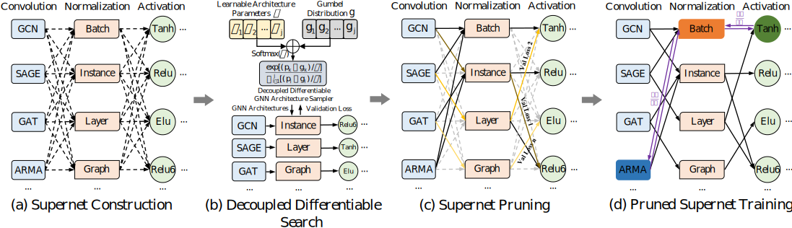

# D<sup>2</sup>GNAS

- D<sup>2</sup>GNAS is an efficient graph neural architecture search method with decoupled differentiable search.

- The framework of D<sup>2</sup>GNAS is as follows:

<br>
<div align=left>  </div>


## Install based on Ubuntu 16.04

- **Ensure you have installed CUDA 11.1 before installing other packages**

**1.Python environment:** recommending using Conda package manager to install

```python
conda create -n d2gnas python=3.7
source activate d2gnas
```

**2.Python package:**
```python
torch == 1.8.2
torch-geometric == 2.0.2
torch-scatter == 2.0.7
torch-sparse == 0.6.11
hyperopt == 0.1.2
```
## Run the Experiment
**1.Performance test with manual GNN and the optimal GNN designed by D<sup>2</sup>GNAS**
```python
python performance_test.py
```

**2.Search the top promising GNN architectures from scratch with all GNAS methods and test with HPO**
```python
step1:python search_from_scratch.py
step2:python performance_test_with_hpo.py
```

**3.Unzip the cs_phy.tar.gz in the dataset file first for CS and Physics testing**
```python
tar -xvf cs_phy.tar.gz
```
